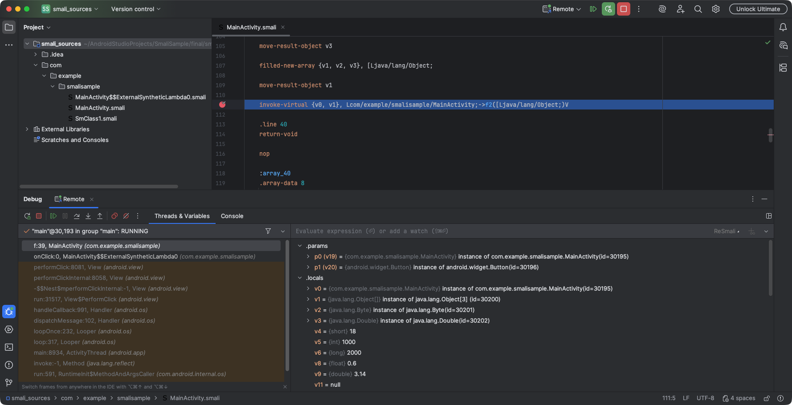
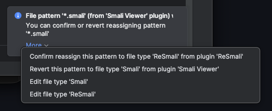
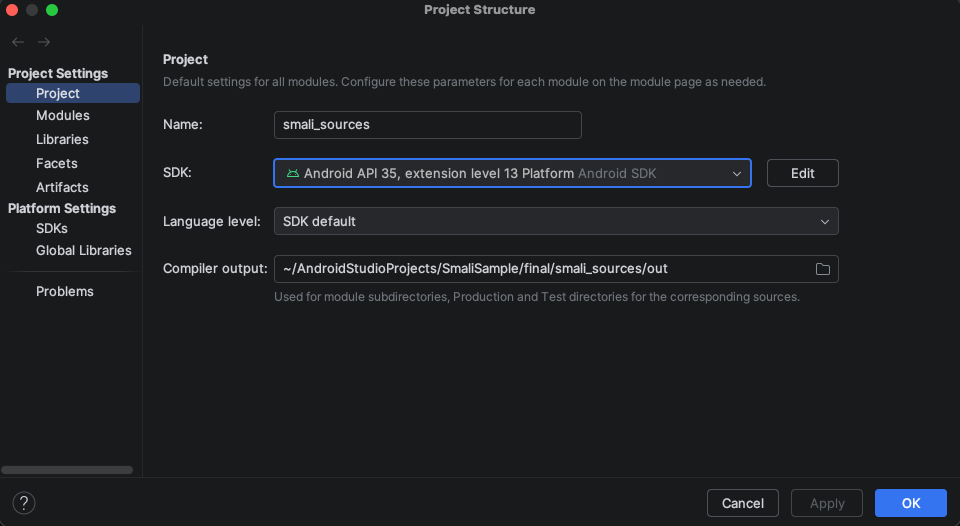
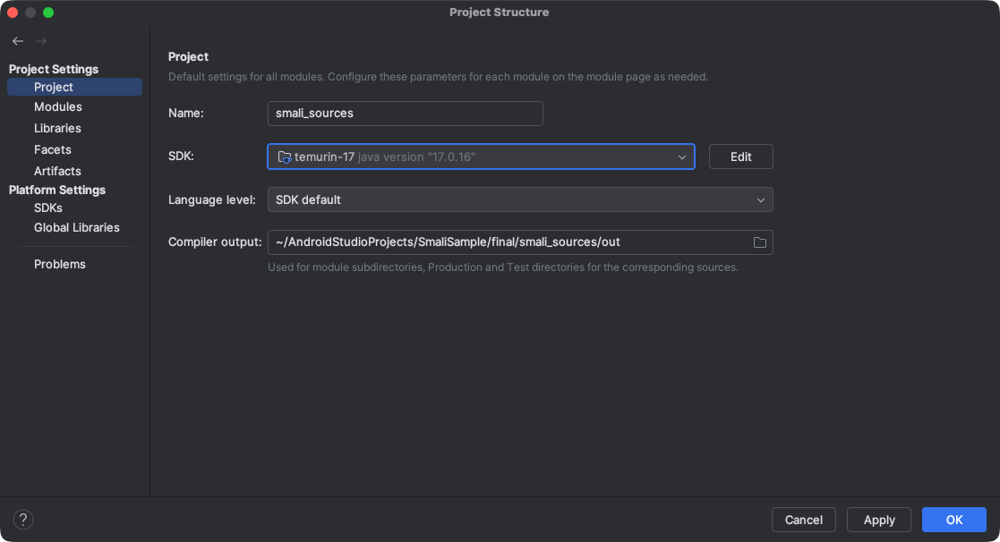
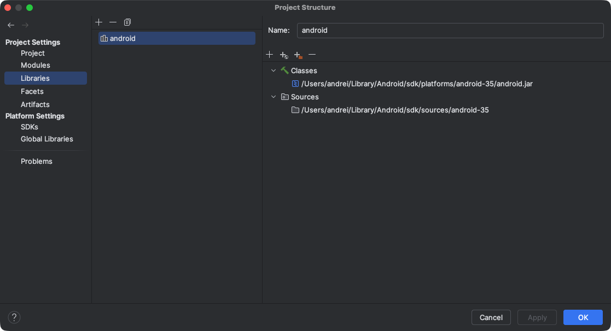

# ReSmali

ReSmali is a fork of the original [smalidea](https://github.com/JesusFreke/smalidea) plugin by Ben Gruver (JesusFreke).
Renamed to comply with
JetBrains' [plugin name policy](https://plugins.jetbrains.com/docs/marketplace/best-practices-for-listing.html?_cl=MTsxOzE7V3RwUWFGU1hRcUpnUFRmaHMwQ1hITnpiVTlwZ25RRnpzY1Z2V3A3RTZ6OE5BVW1ISTZ2eFZ3bzQxZEY5OXY1STs%3D#plugin-name).

> [!WARNING]  
> Plugin is still in the development stage and bugs are expected. Please report any issues. Thank you.

# Features

* Syntax highlighting
* Basic refactoring (renaming)
* Navigation, search (go to definition, find usages)
* Structure view
* Debugging
    * Registers listing
    * Instruction-level single stepping
    * Examining objects' internal state
    * Conditional breakpoints
    * Altering register value at runtime
    * Walking stack frames
    * Evaluate expressions/watches using registers

# Building from Source

Run `./gradlew buildPlugin`.

The resulting ZIP file is located in `./build/distributions/` and can then be installed in
the IDE
via [Install Plugin from Disk](https://www.jetbrains.com/help/idea/managing-plugins.html#install_plugin_from_disk)
action.

# How to Use

There are other smali plugins out there. You may see a pop-up about conflicting file extensions if you are:

- using Android
  Studio ([plugin](https://cs.android.com/android-studio/platform/tools/adt/idea/+/mirror-goog-studio-main:smali/;drc=340fbf48f2e4e69dcea79c3a853e1dc2d801f5cd)
  is bundled);
- using IntelliJ IDEA and have [Smali Viewer](https://plugins.jetbrains.com/plugin/22067-smali-viewer) installed;

It happens because we are all trying to assign .smali files to plugin-specific file types. Select ReSmali here.

    
Conflicting extensions

    

The following steps assume that you have already made your app's process debuggable
(patched manifest / hooked process start / etc.) and
launched it.

## Android Studio

1. Either import an APK using [Profile or debug APK](https://developer.android.com/studio/debug/apk-debugger.html) or
   "File" → "Open" a disassembled APK ([apktool](https://apktool.org/) /
   using [baksmali](https://github.com/baksmali/smali) directly / etc.)
2. "Run" → "Attach Debugger to Android Process".
3. Select your process.
4. _Optionally_. Set up project's SDK if you want to evaluate expressions using classes from JDK or Android Framework or
   navigate to them. "File" → "Project Structure":
    

        
Android SDK

        
    

5. The application should pause when the breakpoint is hit.

## IntelliJ IDEA

1. "File" → "Open" a disassembled APK ([apktool](https://apktool.org/) /
   using [baksmali](https://github.com/baksmali/smali) directly / etc.)
2. Setup ADB forwarding:
    1. Get process ID via `adb shell pidof <package>` or `adb shell ps | grep <package>`
    2. Run `adb forward tcp:8704 jdwp:<pid>` (port can be arbitrary).
3. In IDE "Run" → "Edit Configurations..." → "Add" → "Remote JVM Debug" with port from previous step.
4. Run debug configuration.
5. _Optionally_. If you want to evaluate expressions using classes from JDK or Android Framework (which includes JDK) or
   navigate to them, you have to set project's SDK. "File" → "Project Structure":
    

        
JDK

        
    

    

        
Android SDK

        Sources are added via plus button under library name.
         
        
    

6. The application should pause when the breakpoint is hit.
